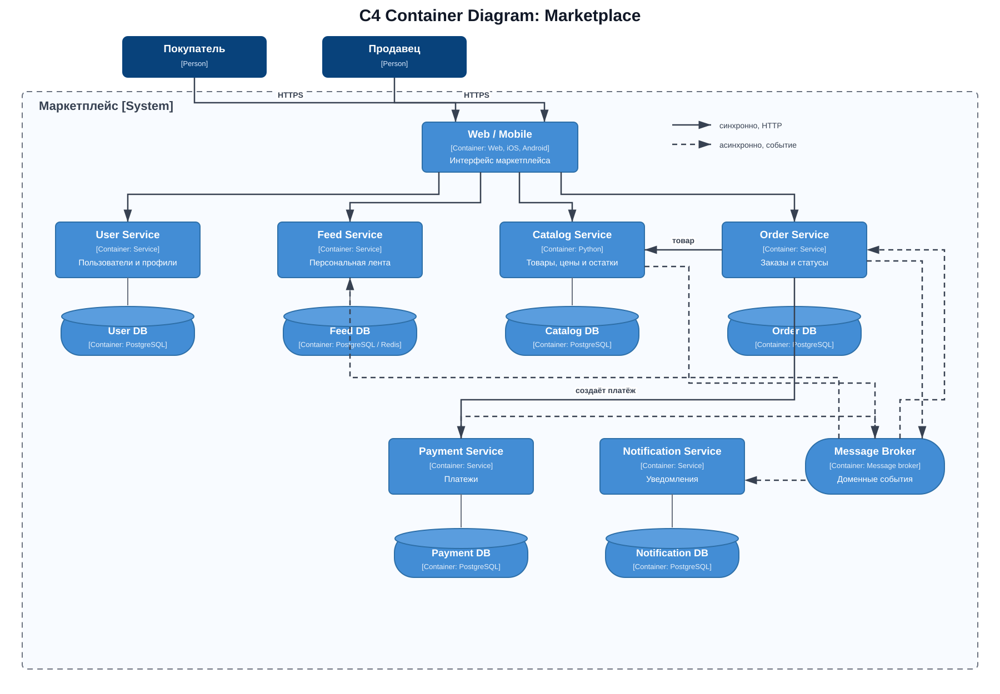

# Архитектура маркетплейса

В проекте спроектирована архитектура маркетплейса и поднят один сервис без бизнес-логики. Catalog Service запускается в Docker и отвечает на `/health`.

## Запуск

Из корня репозитория:

```bash
cd hw1
docker compose up --build -d
```

Проверка:

```bash
curl -i http://localhost:8000/health
```

Сервис должен вернуть `200 OK`:

```json
{"status":"ok"}
```

Остановка:

```bash
docker compose down
```

## Архитектура

C4 Container-диаграмма:



| Домен | Сервис | Ответственность | Данные |
|---|---|---|---|
| Пользователи | User Service | Покупатели, продавцы и профили | Пользователи, роли, профили, адреса |
| Каталог | Catalog Service | Товары, категории, цены и остатки | Товары, категории, цены, остатки |
| Лента | Feed Service | Персонализированная выдача товаров | Интересы пользователя и рекомендации |
| Заказы | Order Service | Оформление заказов и изменение статусов | Заказы, позиции и история статусов |
| Платежи | Payment Service | Расчёт и учёт платежей | Платежи и попытки оплаты |
| Уведомления | Notification Service | Уведомления о статусах заказов | Шаблоны и история отправки |

Сервисы разделены по бизнес-доменам: у каждого своя ответственность и свои данные. Общих баз данных нет. Между сервисами данные передаются через HTTP или события.

Лента персонализируется по категориям товаров, которые пользователь просматривал или покупал. Рекомендации обновляются асинхронно, поэтому небольшая задержка допустима.

## Взаимодействие сервисов

| Откуда | Куда | Способ | Назначение |
|---|---|---|---|
| Web / Mobile | User, Catalog, Feed, Order | Синхронно, HTTP | Запросы пользователя |
| Order Service | Catalog Service | Синхронно, HTTP | Проверка товара, цены и остатка |
| Order Service | Payment Service | Синхронно, HTTP | Создание платежа |
| Catalog, Order, Payment | Message Broker | Асинхронно | Публикация изменений |
| Message Broker | Feed, Order, Notification | Асинхронно | Обновление ленты, заказа и отправка уведомлений |

## Варианты декомпозиции

### Модульный монолит

Все домены находятся в одном приложении и разделены на внутренние модули.

Плюсы:

- проще запускать, тестировать и развёртывать;
- не нужны сетевые вызовы между модулями.

Минусы:

- нельзя независимо масштабировать отдельные части системы;
- изменение одного модуля требует развёртывания всего приложения.

### Микросервисы по доменам

Каждый домен реализован отдельным сервисом и владеет собственной базой данных.

Плюсы:

- сервисы можно независимо развивать и масштабировать;
- границы ответственности и владения данными явно разделены.

Минусы:

- сложнее развёртывание и мониторинг;
- нужно учитывать сетевые ошибки и eventual consistency.

## Выбор

Выбран вариант с микросервисами по доменам. Для маркетплейса важно отдельно масштабировать каталог, ленту и заказы, а также не смешивать данные разных доменов.

В рамках этого задания реализован только Catalog Service с `/health`. Остальные сервисы, базы данных и брокер показаны на C4-диаграмме, но не запускаются, поскольку бизнес-логика на данном этапе не требуется.
