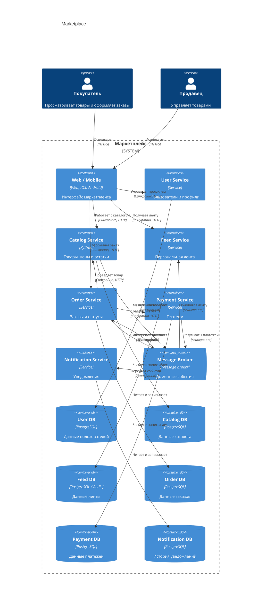

# C4 Container Diagram

```mermaid
C4Container
    title Marketplace

    Person(buyer, "Покупатель", "Просматривает товары и оформляет заказы")
    Person(seller, "Продавец", "Управляет товарами")

    System_Boundary(marketplace, "Маркетплейс") {
        Container(client, "Web / Mobile", "Web, iOS, Android", "Интерфейс маркетплейса")

        Container(users, "User Service", "Service", "Пользователи и профили")
        Container(catalog, "Catalog Service", "Python", "Товары, цены и остатки")
        Container(feed, "Feed Service", "Service", "Персональная лента")
        Container(orders, "Order Service", "Service", "Заказы и статусы")
        Container(payments, "Payment Service", "Service", "Платежи")
        Container(notifications, "Notification Service", "Service", "Уведомления")

        ContainerQueue(broker, "Message Broker", "Message broker", "Доменные события")

        ContainerDb(users_db, "User DB", "PostgreSQL", "Данные пользователей")
        ContainerDb(catalog_db, "Catalog DB", "PostgreSQL", "Данные каталога")
        ContainerDb(feed_db, "Feed DB", "PostgreSQL / Redis", "Данные ленты")
        ContainerDb(orders_db, "Order DB", "PostgreSQL", "Данные заказов")
        ContainerDb(payments_db, "Payment DB", "PostgreSQL", "Данные платежей")
        ContainerDb(notifications_db, "Notification DB", "PostgreSQL", "История уведомлений")
    }

    Rel(buyer, client, "Использует", "HTTPS")
    Rel(seller, client, "Использует", "HTTPS")

    Rel(client, users, "Управляет профилем", "Синхронно, HTTP")
    Rel(client, catalog, "Работает с каталогом", "Синхронно, HTTP")
    Rel(client, feed, "Получает ленту", "Синхронно, HTTP")
    Rel(client, orders, "Оформляет заказ", "Синхронно, HTTP")

    Rel(orders, catalog, "Проверяет товар", "Синхронно, HTTP")
    Rel(orders, payments, "Создаёт платёж", "Синхронно, HTTP")

    Rel(users, users_db, "Читает и записывает")
    Rel(catalog, catalog_db, "Читает и записывает")
    Rel(feed, feed_db, "Читает и записывает")
    Rel(orders, orders_db, "Читает и записывает")
    Rel(payments, payments_db, "Читает и записывает")
    Rel(notifications, notifications_db, "Читает и записывает")

    Rel(catalog, broker, "Изменения товаров", "Асинхронно")
    Rel(orders, broker, "Изменения заказов", "Асинхронно")
    Rel(payments, broker, "Результаты платежей", "Асинхронно")
    Rel(broker, feed, "Обновляет ленту", "Асинхронно")
    Rel(broker, orders, "Обновляет заказ", "Асинхронно")
    Rel(broker, notifications, "Передаёт события", "Асинхронно")

    UpdateLayoutConfig($c4ShapeInRow="4", $c4BoundaryInRow="1")
```
